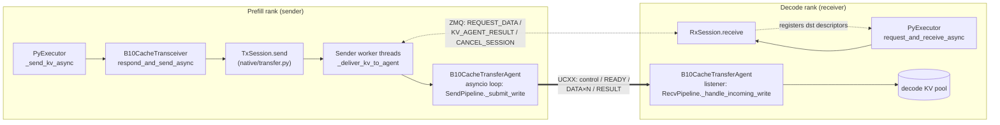
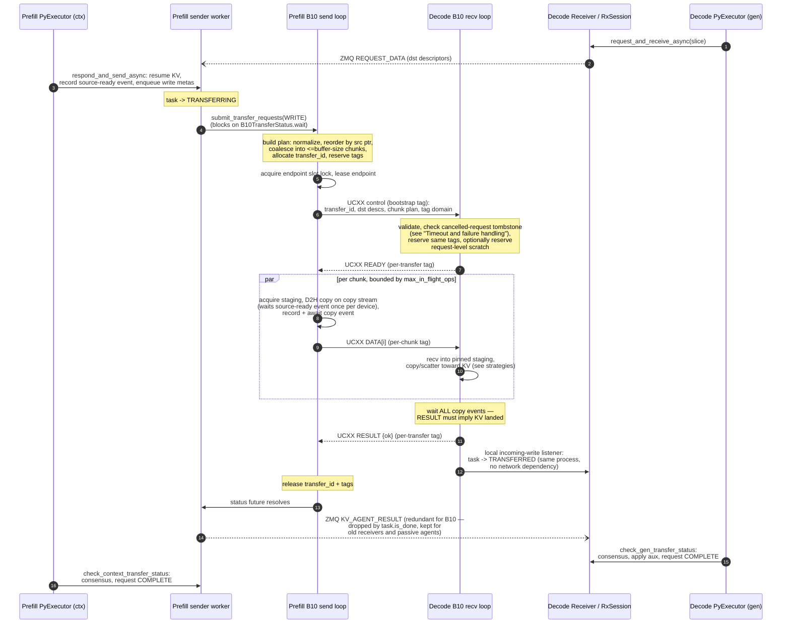
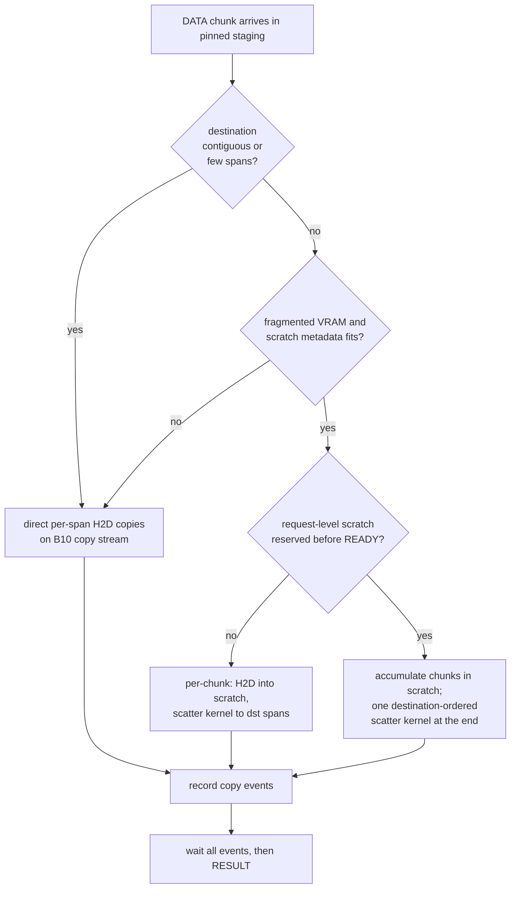
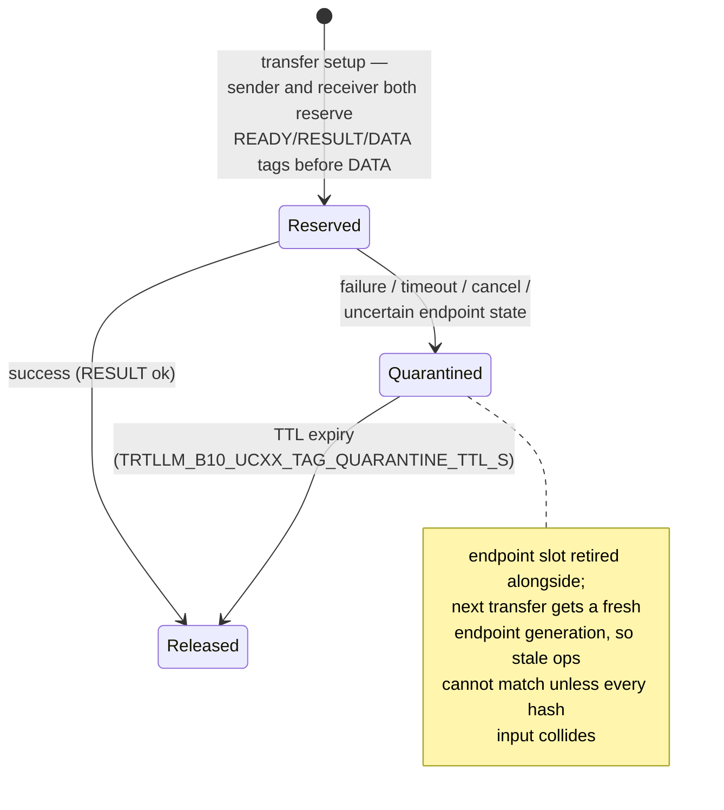

<!--
SPDX-FileCopyrightText: Copyright (c) 2026 Baseten Labs, Inc. All rights reserved.
SPDX-License-Identifier: Apache-2.0
-->

# B10 Cache Transceiver Design

B10 is an opt-in Python cache transceiver with a UCXX (Python bindings for
UCX) data plane. It plugs into the existing V2 session/scheduling machinery —
the shared Python transceiver layer in `disaggregation/transceiver.py` and
`native/transfer.py` — as a transfer *agent*: V2 continues to own request
orchestration, KV slicing (splitting a request's KV across peer ranks),
cancellation, and status flow, while B10 owns only how bytes move between
ranks.

```yaml
cache_transceiver_config:
  backend: UCX
  transceiver_runtime: B10
```

Throughout this doc, *prefill* and *decode* name the two disaggregated roles;
code and logs call the same roles *ctx* (context) and *gen* (generation).

Recent deployment testing has shown performance on par with NIXL for the
target workload. B10 remains opt-in until it has been exercised across more
production traffic shapes.

## Why B10 exists

The goal of B10 is to prove that a pure Python transceiver can match the
performance of the C++ data planes while keeping all the benefits of Python:
a fast development loop, an explicit and auditable protocol, and cheap
iteration on production incidents. The design is fault-tolerance-first
through host staging: every receive lands in pinned host memory before
touching a live destination buffer, so a failed or suspect transfer can be
quarantined and its staging replaced without ever risking foreign bytes in
the KV cache.

Beyond disaggregated serving, this transceiver is the intended backbone for
a future B10 KV cache layer in which Baseten owns both the storage and the
network transfer stacks end to end — the same staging pools, transfer
protocol, and array-native descriptor machinery generalize from
rank-to-rank KV movement to tiered KV storage and retrieval.

By contrast, the C++ v1 code path (the upstream C++ transceiver that predates
V2) is difficult to reason about: endpoint
lifetime, tag ownership, staging-buffer safety, timeout behavior, and cleanup
are spread across implicit state and upstream-coupled code. That makes
rebases expensive and slows iteration. B10 keeps the data-plane protocol
explicit in Python so the development loop stays fast.

Design goals:

- Reuse `KvCacheTransceiverV2` session, peer registration, KV slicing, cancellation, and status
  flow; implement only `WRITE` transfers.
- Own tag derivation, active tag tracking, and quarantine in TensorRT-LLM
  code — never reuse a tag that might still match a stale operation.
- Receive into pinned host staging before copying into final destinations;
  use preallocated GPU scratch for fragmented VRAM receive copies.
- Keep persistent endpoints and bounded in-flight DATA chunk tasks.
- Keep integration hooks narrow and easy to rebase.

Non-goals: rewriting the scheduler or the V2 session classes
(`TxSession`/`RxSession`, `Sender`, `Receiver` in `native/transfer.py`);
supporting transfer ops other than `WRITE`; supporting non-KV
object/file/block transfer modes.

## Architecture

Two message planes coexist and are easy to conflate. The **native plane**
(ZMQ) belongs to the shared V2 transceiver and carries request orchestration:
peer registration, receive-request registration, agent results, and session
cancellation. The **B10 plane** (UCXX) carries the actual transfer protocol
and payload bytes. B10 replaces only the box that NIXL previously filled.

**The main idea: B10 inherits directly from
the V2 KV cache transceiver and overrides exactly one thing — the transfer
agent. That inheritance is what saves us from the higher-level control
business logic: which requests transfer, when, to whom, cancellation,
timeouts, cross-rank consensus — all of that stays in V2, untouched. The
layer B10 actually works at is much simpler: V2 hands the agent a list of
raw source and destination memory spans — plain (pointer, size) pairs
referencing KV blocks directly in the KV cache on each side — and B10's
entire job is to make the destination bytes equal the source bytes.
Everything else in this document (staging, chunking, tags, kernels,
quarantine) exists to do that one job fast and safely.**

**Where B10 stops and UCXX begins: B10 owns everything that has meaning —
the message protocol (control/READY/DATA/RESULT), tags and their
quarantine, endpoint lifecycle policy, staging pools, chunk planning,
timeouts, and completion. UCXX is used as a dumb pipe: B10 hands it a
buffer and a 64-bit tag and says "send this on that endpoint" or "receive
whatever arrives with this tag into here." Connection wireup, transport
selection (RDMA vs TCP), rendezvous, and physically moving bytes over the
NIC belong to UCXX/UCX. UCXX knows nothing about requests or KV; B10 knows
nothing about NICs.**

Animated versions of this architecture, the WRITE sequence, and the
quarantine flow live at
<https://basetenlabs.github.io/tmp-animations/b10-transceiver.html>.



`B10CacheTransceiver` (`b10/transceiver.py`) subclasses `KvCacheTransceiverV2`
(`disaggregation/transceiver.py`) and overrides `_create_transfer_agent` to
create `B10CacheTransferAgent` (`b10/agent.py`). V2 passes this bound method to
`TransferWorkerConfig.agent_factory` (`native/transfer.py`); its default method
creates the existing NIXL agent.

| File | Owns |
|---|---|
| `b10/transceiver.py` | V2 adapter: staging-pool derivation, source-KV readiness (`resume_request` + source-ready event), B10-specific timeout recovery |
| `b10/agent.py` | composition shell: UCXX listener and the agent event-loop thread, agent config wiring and collaborator construction, in-flight chunk windowing (`_run_limited`), scatter-kernel warmup, shutdown |
| `b10/core.py` | `_AgentCore`: shared live state (loop, transfer ids, tag registry, staging/scratch pools, copy streams, config knobs) and the staging-slot plumbing |
| `b10/send.py` | send pipeline collaborator (`SendPipeline`): submit surface, send plan and control message build, source validation, staging gather, DATA sends, admission gating |
| `b10/recv.py` | recv pipeline collaborator (`RecvPipeline`): incoming-write handler, packed control decode, staging-to-destination copies, recv scratch and request-level scatter routing, recv cancellation tombstones |
| `b10/endpoints.py` | endpoint pool collaborator (`EndpointPool`): peer descriptor registry, slot leasing, generation retirement, stale-endpoint refresh, abort arming |
| `b10/timings.py` | transfer tracing and per-transfer timing logs (`TransferTrace` collaborator) |
| `b10/config.py` | `B10AgentConfig`: env-var parsing and agent defaults |
| `b10/protocol.py` | agent descriptors, control/reply packing, transfer-ID allocation, tag derivation, tag registry |
| `b10/memory.py` | array-backed container vocabulary: descriptor/span views and the scatter-plan/chunk/buffer-view types |
| `b10/planning.py` | descriptor normalization and ingestion, chunk coalescing, span building, overlap/stat checks, copy planning |
| `b10/pools.py` | pinned staging pool, CUDA scratch pool, copy-stream pool, quarantine bookkeeping |
| `b10/kernels.py` | Triton scatter/gather kernels, kernel-metadata assembly and upload, local copy helpers, kernel warmups |
| `b10/state.py` | transfer status, endpoint leases, abort handles, checkout tracking |
| `b10/async_utils.py`, `b10/net.py` | timeout wrappers, endpoint abort helpers, retry classification, UCXX import and progress-mode default, listener address handling |
| `disaggregation/transceiver.py`, `native/transfer.py` | generic V2 hooks: agent factory, request sync metadata, cancellation, status drain |
| `pyexecutor/kv_cache_transceiver.py`, `llmapi/llm_args.py` | public runtime selection |

### Reading guide

Suggested order for a first end-to-end read; each step assumes only the
ones before it:

1. **`protocol.py`** — the wire vocabulary: agent descriptors and feature
   flags, transfer-id allocation, tag derivation, and the tag registry.
   Everything else speaks in these terms.
2. **`memory.py`** — the container vocabulary and the array-native
   contract (see [Array-native hot path](#array-native-hot-path)).
3. **`planning.py`** — descriptors in, plans out: normalization, chunk
   coalescing, span building, scatter planning. Pure functions, no I/O.
4. **`pools.py`** — the pinned staging pool, CUDA scratch pool, and copy
   streams, plus quarantine mechanics
   ([Buffer ownership](#buffer-ownership)).
5. **`core.py`** — `_AgentCore`, the shared-state hub every collaborator
   holds; staging-slot admission lives here.
6. **`send.py`, then `recv.py`** — the two pipelines, one direction each
   ([Anatomy of a WRITE](#anatomy-of-a-write)), with `endpoints.py` on the
   way for slot leasing and generation retirement.
7. **`agent.py`** — the composition shell that wires the collaborators,
   then `transceiver.py` for the V2 seam.

`kernels.py`, `state.py`, `timings.py`, `async_utils.py`, and `net.py` are
leaf toolboxes; read them on demand from their call sites.

### Source and destination spans

How the span lists B10 receives come to exist — all of it V2/native
machinery (`Sender._build_kv_write_meta` in `native/transfer.py`); B10 never
participates:

1. The decode rank allocates paged KV blocks for the incoming request and
   sends just the **block IDs** (per layer group) to the prefill rank over
   the native plane (`REQUEST_DATA`). No addresses cross the wire.
2. The prefill rank aligns both sides' block lists over the common token
   range (with cache reuse, the lists cover only the non-cached tail).
3. Block IDs become raw addresses with pool-base + block-stride arithmetic
   on both sides — the prefill rank can compute the *peer's* addresses
   locally because pool base pointers were exchanged at peer registration.
4. When the two sides' in-block layouts differ (TP/head mismatch), each
   block expands into per-head fragments — the main source of span
   fragmentation.

The result is a pair of size-matched pointer arrays handed to the transfer
agent. The two allocators never coordinate, so contiguity on one side
implies nothing about the other — the problem the "Performance state"
section starts from.

## Conventions in the code

Cross-cutting contracts the code assumes everywhere but states nowhere else:

- **Leading underscore = package-internal.** The public surface is
  `B10CacheTransceiver` / `B10CacheTransferAgent`, `B10AgentConfig`, and the
  protocol descriptor/registry classes. Every `_name` is shared freely
  *between* b10 modules but carries no stability guarantee outside the
  package.
- **`*_locked` suffix = caller already holds the lock.** A `_foo_locked`
  method never takes its owner's lock itself; it must only be called with
  that lock held.
- **Every await inside a transfer is deadline-fenced.** Waits take the
  transfer's `_TransferDeadline`, and `remaining_s()` *raises*
  `TimeoutError` the moment the deadline passes — it never returns zero or
  a negative. Retry loops are therefore time-bounded by construction, not
  count-bounded.
- **Failure quarantines; success releases.** On failure, resources the peer
  might still act on (staging views, message tags, endpoint generations,
  transfer ids) are parked for a TTL instead of returned — see
  [Fault tolerance model](#fault-tolerance-model). Purely local resources
  (VRAM scratch) are released directly.
- **Cancellation is `asyncio.CancelledError`**, a `BaseException`: it
  deliberately bypasses every `except Exception` warning block and reaches
  the transfer-level failure funnels without producing error-log noise.
- **Timing keys accumulate over chunks** — read them against the pipeline
  shape, not as wall time
  ([Reading the timing logs](#reading-the-timing-logs)).
- **Collaborators receive injected callables** captured once at
  construction in `agent.py` `__init__`, stored under fields named
  identically to the method they point at; nothing is monkey-patched after
  construction.

## Threading model

Five persistent threads per rank carry the whole transfer stack:

| Thread | Created at | Runs |
|---|---|---|
| B10 agent asyncio loop | dedicated thread + `new_event_loop` in `agent.py` | all B10 work: UCXX listener handler, send/recv coroutines, plan build, pool acquisition, kernel-metadata assembly and launches, endpoint leasing/retirement, timing logs |
| native Sender delivery worker(s) | `Sender.__init__` (`native/transfer.py`) | dequeue `WriteMeta`s, submit to the agent, block on `TransferStatus.wait` per transfer; count = `TRTLLM_KV_TRANSFER_NUM_THREADS` (default 1) |
| ZMQ listener ×2 | `ZMQMessenger.start_listener`, one per ROUTER (Sender's and Receiver's) | native-plane control: REQUEST_DATA, KV_AGENT_RESULT, CANCEL_SESSION |
| UCXX progress thread | ucxx, `thread-polling` mode | C++ busy-poll of the UCX worker (the one deliberately spinning core; GIL-free except future-notifier handoffs to the agent loop) |

Transient threads exist only on failure paths and exit immediately:
`b10-endpoint-abort` (`async_utils.py` — a blocking `Endpoint.abort()` must
never stall the agent loop) and the staging-pool background refill
(`pools.py`, after quarantine drains the pool).

Everything that looks parallel — in-flight DATA chunks
(`max_in_flight_ops`), concurrent large sends (the admission gate),
concurrent receives — is asyncio tasks multiplexed on the one agent-loop
thread, not threads. One Python thread owns the data plane, so the
transfer stack's GIL take is a single thread's share and the executor
never contends with a thread pool. Corollary: with the default single
Sender worker, sends serialize at the native plane (the worker blocks on
each transfer before dequeuing the next); raising
`TRTLLM_KV_TRANSFER_NUM_THREADS` is what enables overlapping sends, which
the admission gate and endpoint slots then bound.

## Anatomy of a WRITE

Each B10 agent advertises a msgpack descriptor (`B10AgentDescriptor` in
`protocol.py`) over the native registration plane:

```text
{ protocol: "b10-ucxx", version: 1, name, host, port,
  tag_domain: <random 64-bit agent tag domain>,
  features: [additive capability flags, e.g. "packed_descs"] }
```

Features are additive capability flags — peers can run with different
protocols, and we pick the best one that both support. This is intentionally
aiming at supporting k8s rollouts. The current floor is `packed_descs`;
senders refuse peers that do not advertise it.

When `UCX_NET_DEVICES` is set, B10 resolves the first mappable UCX device
entry to a Linux netdev and asks UCXX to advertise an address from that
interface (`_advertised_ifname_from_ucx_net_devices` in `net.py`). Otherwise
UCXX chooses the listener address.

The full path of one KV transfer, thread by thread. Two terms used below: a
*write meta* (`WriteMeta` in `native/transfer.py`) is the sender-side work
item for one KV slice, and *request sync metadata* (`sync_message`) is the
request-identity blob carried in the control message so the receiver can
attribute an incoming write to its request.



The four B10 messages, in order:

| Message | Direction | Tag | Carries | Meaning |
|---|---|---|---|---|
| control | sender → receiver | fixed bootstrap tag | `transfer_id`, packed destination descriptors, chunk plan, sender tag domain, endpoint generation, request sync metadata | "here is what I am about to write and exactly where it goes" — the receiver validates, reserves the matching tags, and optionally reserves request-level scratch |
| READY | receiver → sender | per-transfer | `transfer_id`, ok | "destination is set up and tags are reserved — start sending"; delaying it is how the receiver applies backpressure |
| DATA ×N | sender → receiver | per-chunk | payload bytes, one message per coalesced chunk | the actual KV bytes, staged and shipped chunk by chunk |
| RESULT | receiver → sender | per-transfer | `transfer_id`, ok/error | "every destination copy event completed — the KV physically landed" (invariant 3); on ok the sender releases the transfer ID and tags |

Key invariants encoded in that flow (referenced by number elsewhere in this
doc):

1. Descriptor pairs are reordered by source pointer only when source and
   destination ranges do not overlap; pair mapping is preserved and
   destination fragmentation is handled on the receive side.
2. The sender's copy stream never reads source VRAM before the source-ready
   event — a CUDA event recorded once the request's KV is resident on device
   (`_record_source_ready_event` in `b10/transceiver.py`); a VRAM send
   without request sync metadata or a source-ready event fails before DATA.
3. The receiver sends RESULT only after every destination copy event has
   completed, so a sender observing success implies the KV physically landed.
4. Success releases the transfer ID and tags; failure, timeout, cancellation,
   or uncertain endpoint state quarantines them and retires the endpoint slot.
5. Receive-side completion is local: the agent's terminal incoming-write
   signal (fired at the same point the RESULT is sent, i.e. after all
   destination copies) completes the receive task in-process. The sender's
   ZMQ notification is a compatibility echo, deduplicated by task state; it
   is load-bearing only for pre-listener receivers, for passive-receiver
   agents (NIXL), and for multi-slice / multi-peer session shapes where a
   local signal cannot be attributed to a (slice, peer) pair.

`transfer_chunks` (the chunk plan carried in the control message) is wire
metadata only. It does not change KV ownership, MLA (multi-head latent
attention) state, or cache-formatter semantics; it packs adjacent bytes for
transport and
writes them back to the original destination ranges.

## Chunking, copies, and receive strategies

B10 separates three granularities:

| Term | Meaning |
|---|---|
| descriptor | original V2 memory descriptor (~1 MiB blocks typically) |
| DATA chunk | wire message, descriptors coalesced up to the staging-buffer size |
| local span | contiguous pointer run inside one DATA chunk |

Source-pointer ordering (`_reorder_desc_pairs_for_contiguity` and
`_coalesce_memory_descs` in `planning.py`) means sender staging approaches one
copy per DATA chunk for mostly-contiguous KV. With 512 MiB buffers and ~1 MiB
descriptors, about 512 descriptors fit per full DATA message.

The receive side picks a copy strategy per chunk (`_should_use_recv_scratch`
and `_copy_chunk_between_staging_and_descs` in `recv.py`; the scatter
kernels live in `kernels.py`):



Request-level scratch reservation converts scratch pressure into handshake
backpressure (the READY is delayed) instead of silently falling back to slow
direct per-span copies. If a final scatter may have started but B10 cannot
record a completion event, it synchronizes the copy stream before clearing
state and retires those scratch buffers.

The Triton scatter kernels (spans/request × aligned-u64/byte) are compiled at
agent startup (`_warm_scatter_kernels_at_startup` in `agent.py`, kernels in
`kernels.py`); JIT on first use costs over a second
per process and would otherwise land in the first fragmented recv's data
phase.

## Reading the timing logs

`TRTLLM_B10_UCXX_TRACE_TRANSFERS=info` emits one line per transfer per side
(`_log_send_transfer_timings` / `_log_recv_transfer_timings` in
`timings.py`).
Two rules prevent misreading them:

- **Wall-clock fields** (`total_ms`, `data_phase_wall_ms`, `control_ready_ms`,
  `slot_lock_wait_ms`, `lease_ms`, `result_recv_ms`) nest and roughly sum to
  `total_ms`.
- **Cumulative fields** (`ucxx_send_ms`, `ucxx_recv_ms`, `copy_event_wait_ms`,
  `staging_acquire_ms`, ...) are summed across concurrent per-chunk
  coroutines and can legitimately exceed `total_ms` by a large factor. In
  particular, N chunks waiting on one serialized copy stream sum to roughly
  N(N+1)/2 × per-copy time: a healthy 3.3 ms/chunk D2H shows up as
  `copy_event_wait_ms=1898` for 33 chunks. Divide by the triangular number
  before concluding anything is slow.

| Field | Type | Meaning |
|---|---|---|
| `request_id` | id | disagg request id — join key across the send line, the recv line, and the wrapper's per-request logs |
| `total_ms` | wall | whole transfer, from `_submit_write` entry |
| `plan_build_ms` | wall | descriptor normalize/reorder/coalesce/span statistics (numpy path; ~2 ms for 10k descriptors) |
| `admission_wait_ms` | wall | queueing at the per-agent large-send gate (see `TRTLLM_B10_UCXX_SEND_ADMISSION_LIMIT` under "Runtime knobs"); the healthy signature under load is waits here while `staging_acquire_ms` stays near zero |
| `slot_lock_wait_ms` | wall | queueing behind the in-flight transfer to the same peer (endpoint pool size 1) |
| `lease_ms` | wall | endpoint create/refresh inside the lock; large on first contact with a peer (UCX wireup) |
| `control_ready_ms` | wall | control send + READY wait (includes receiver-side setup and scratch reservation) |
| `data_phase_wall_ms` | wall | bounded DATA copy/send (send) or recv/copy (recv) pipeline |
| `result_recv_ms` / `result_send_ms` | wall | RESULT round-trip tail |
| `staging_acquire_ms`, `recv_scratch_acquire_ms` | cumulative | pool checkout waits across chunks |
| `src_copy_ms`, `dst_copy_ms` | cumulative | local copy/scatter enqueue time |
| `h2scratch_ms`, `request_scatter_ms` | cumulative | request-level scatter split: staging→scratch copies, final scatter enqueue |
| `copy_event_wait_ms` | cumulative | CUDA copy-event waits across chunks |
| `ucxx_send_ms`, `ucxx_recv_ms` | cumulative | UCXX await time across concurrent chunks |
| `request_scatter_chunks/fragments/kernels` | count | request-level scatter shape |

## Tag discipline

READY, RESULT, and DATA tags are derived from:

```text
pair_tag_domain = hash(local_agent_domain, remote_agent_domain, slot_index)
tag             = hash(pair_tag_domain, endpoint_generation,
                       transfer_id, chunk_index, kind)
```

(Derivation: `_pair_tag_domain` and `_message_tag` in `protocol.py`; final
tags are reserved in `B10TagRegistry`, transfer IDs come from
`B10TransferIdAllocator`.) `pair_tag_domain` is B10's per-agent-pair/slot
namespace, not a UCX primitive; `chunk_index` is the coalesced DATA chunk
index; `slot_index` and `endpoint_generation` identify one per-peer endpoint
slot and its replacement count (both defined under "Endpoint lifecycle").



B10 never intentionally reuses a final UCX tag while it is active or
quarantined. If reservation collides, the transfer fails before DATA or the
sender retires the endpoint and retries control once. Registry work is per
transfer setup/teardown, not per DATA operation.

The bootstrap control receive uses a fixed tag because the receiver does not
know the transfer ID before reading control. It carries no KV bytes and is
scoped by UCXX endpoint tagging. READY/RESULT payloads include `transfer_id`,
and the sender rejects mismatches.

Future hardening: remove TTL expiry for transfer IDs, final tags, and
uncertain staging buffers. That leaks resources for process lifetime but
avoids assuming late UCX operations eventually become harmless; a separate
transceiver process could later be restarted independently to reclaim them.

## Fault tolerance model

The doctrine behind the mechanism sections that follow: **on any
uncertainty, quarantine the resource and retire the identity — never reuse
anything UCXX might still touch.** A transfer that fails cleanly releases its
resources; a transfer whose state is unknowable (timeout, peer death, late
completion) forfeits them instead. Host staging is what makes this doctrine
affordable: because every receive lands in pinned host memory before any
destination copy, the blast radius of a corrupt or late-arriving transfer is
a staging buffer — cheap DRAM that can be quarantined and replaced — never
the live KV cache. Concretely, four resources carry the doctrine:

- transfer IDs and tags are quarantined with a TTL ("Tag discipline");
- staging buffers touched by uncertain operations are quarantined, and
  expired quarantine drops rather than recycles them ("Buffer ownership");
- endpoint generations retire on timeout or peer death, so stale operations
  can never match a successor ("Endpoint lifecycle");
- request IDs grow tombstones on decode timeout so a late receive cannot
  trigger a destination copy ("Timeout and failure handling").

Failures stay request-scoped by design: cleanup never marks the worker
unhealthy, and V2's session/consensus machinery owns turning a forfeited
transfer into a client-visible request failure.

### How this differs from the v1 UCX transceiver

Both designs stage payloads — v1's `CacheTransBufferManager`
(`cpp/tensorrt_llm/batch_manager/cacheTransBuffer.cpp`) pre-allocates
send/recv staging buffers and scatters from staging into KV blocks, just as
B10 does. The reliability differences are contracts, not topology:

- **Failure doctrine.** B10 applies quarantine-on-uncertainty uniformly:
  anything a peer might still act on — staging views, message tags,
  transfer IDs, endpoint generations — sits out a TTL. This fork's v1 UCX
  path has adopted the same containment for staged payload buffers
  (`ucx_utils/payloadStaging.cpp` quarantines failed staged requests,
  holds up to 64, and by default never time-reclaims them). What v1 still
  lacks is the identity half: its tags and request identifiers carry no
  registry or reuse exclusion and return to circulation immediately — and
  that reuse window is where the contamination incidents lived.
- **Staging economics.** In this fork, both transceivers stage payloads
  through pinned host DRAM: v1's UCX path ships payload staging on by
  default (`TRTLLM_UCX_ENABLE_PAYLOAD_STAGING`, a chunked pinned pool with
  pipelined sends), while upstream v1 defaults to device staging via
  `CacheTransBufferManager` with pinned-host as an MLA-only env option.
  Cheap DRAM is what makes quarantine affordable in both. B10's difference
  is that host staging is unconditional and the entire failure contract is
  built on it, rather than arriving as a transport optimization with
  containment attached to one buffer pool.
- **Identity lifecycle: impossible vs improbable.** The worst failure mode
  is silent KV corruption — a late or replayed message tag-matching into
  another transfer's staging and getting scattered into a live request. v1
  derives tags from identifiers that can recur and has no reuse protection.
  B10 hashes tags over (pair domain, endpoint generation, transfer ID,
  chunk, kind), registers every tag before receives post (collision → hard
  failure), quarantines the tags and IDs of failed transfers, and never
  reuses endpoint generations — a stale message has nothing legal to match
  and dies by timeout.
- **Verified completion.** B10's RESULT reply is sent only after CUDA copy
  events prove the bytes physically landed in destination KV; "success"
  means landed, not handed to the NIC. Completion is also decided locally
  on the receiver rather than depending on a cross-plane notification (the
  phantom-timeout incident class).
- **Time-bounding.** Every await inside a B10 transfer is fenced by the
  per-transfer deadline (`remaining_s()` raises at expiry), so there are no
  unbounded waits and no retry counters to tune; every failure exits
  through one funnel per pipeline that sweeps still-checked-out resources
  into quarantine.
- **Failure posture.** The net effect: B10 fails loudly per-transfer and
  keeps the process serving; v1's signature failure was quiet wrongness.
  B10 has not had fewer bugs — it has had bounded, visible, per-request
  ones.

## Timeout and failure handling

| Outcome | Transfer ID / tags | Endpoint |
|---|---|---|
| success | released | kept (persistent) |
| reported failure | quarantined | slot dropped |
| timeout / uncertain state | quarantined | generation retired |
| peer death | quarantined; request failed via V2 session state | generation retired |

Deadline source, in priority order: `kv_transfer_timeout_ms` when configured,
else `TRTLLM_B10_UCXX_TRANSFER_TIMEOUT_S`, else 60 s. One end-to-end deadline
(`_TransferDeadline` in `async_utils.py`) covers endpoint creation, control,
READY, DATA, and RESULT. Idle persistent
endpoints do not consume it while waiting for the next bootstrap control.

Timeout cleanup is request-scoped and must not mark the worker unhealthy. B10
uses non-cancelling await wrappers (`_await_with_timeout(...,
cancel_on_timeout=False)` in `async_utils.py`) so a timeout returns failure
without attempting to cancel a UCXX request from another thread. Before DATA, an
endpoint-creation/control timeout may abort a leased endpoint because no DATA
buffer is exposed; after DATA starts, timeout retires the endpoint generation
but avoids `Endpoint.abort()`.

Decode timeout is conservative: B10 blocks future receives for that request
ID (a TTL-expiring tombstone sized to outlive the sender's transfer deadline)
and cancels the native receive session immediately. Generation status maps
the executor's timed-out Python request IDs to B10 disaggregation IDs, then
keeps the session registered until active receive/copy work has drained on
every participating rank. It force-fails any lingering native KV and AUX
tasks before closing the session. If a UCXX receive completes after
cancellation, B10 checks the tombstone before issuing any destination copy.

Native transfer cancellation is part of the contract: `SendTaskBase`
(`native/transfer.py`) tracks
active agent statuses and propagates cancellation to them, which is what makes
in-flight B10 work drain in bounded time after a cancel.

### Control-plane hardening

A transfer's success must never hinge on the native ZMQ plane staying
healthy — a wedged peer listener once stranded already-completed transfers
until the watchdog killed them. Two independent properties close the class:

1. `ZMQMessenger` (`native/messenger.py`) sockets use unbounded send/recv
   HWMs (control messages are
   ~100 B) and a 10 s `SNDTIMEO`, so a control send can queue but never
   silently block; a residual block raises and becomes a logged task failure.
2. Receive-side completion does not depend on the sender's `KV_AGENT_RESULT`
   notification at all (invariant 5 in "Anatomy of a WRITE"); the
   notification is kept only for old receivers and passive agents.

## Buffer ownership

B10 supports `VRAM` and `DRAM` descriptors (KV and aux transfers; *aux* is
V2's small per-request CPU metadata blob); other
memory types fail explicitly.

**Pinned host staging** (`_PinnedStagingBufferPool` in `pools.py`) —
fixed-size pool; 512 MiB buffers by default; count
derived (`_derive_staging_pool_num_buffers` in `b10/transceiver.py`) from
`max_tokens_in_buffer` and local KV bytes per token (including
indexer K-cache bytes when present); descriptors larger than one staging
buffer fail with a tuning error. Buffers touched by uncertain UCXX operations
are quarantined instead of returned, and the pool refills in the background;
expired quarantine drops buffers rather than returning them.

**Receive GPU scratch** (`_CudaScratchBufferPool` in `pools.py`) —
fixed-size pool preallocated on the agent CUDA device; buffer size matches staging; each buffer owns fixed-capacity device
metadata for per-chunk scatter. Scratch is not a UCX quarantine resource
(UCXX never writes into it); buffers return once their local CUDA event
completes, and an unqueryable event keeps the buffer pending rather than
reallocating scarce GPU memory.

## Endpoint lifecycle

Sender endpoint state is keyed by (peer agent, slot) — `_EndpointSlot` in
`state.py`, leased per transfer by `_get_or_create_endpoint` in
`endpoints.py`.
The default pool size
is one because the default native sender concurrency is one transfer at a time
per worker; larger pools matter only when sender workers submit overlapping
transfers to the same peer. Slots have disjoint tag domains by construction
(`slot_index` is a `pair_tag_domain` input), so growing the pool is
protocol-safe.

When a peer re-registers under the same logical name with a changed
descriptor (`load_remote_agent` in `agent.py`), B10 aborts
and drops the cached endpoints but does not reset the slots' generation
counters; the next transfer creates a fresh endpoint under the next
generation, so its tags can never collide with operations issued to the
peer's previous incarnation. If a cached endpoint is
stale before DATA begins, B10 retires the slot and retries control/READY
once (`_refresh_stale_send_endpoint`). After DATA starts it does not retry, because the receiver may already
have accepted part of the payload. Endpoint retirement must not block the B10
event loop; timed-out generations are abandoned and future transfers use a
new generation and tag set.

## Runtime knobs

| Env var | Default | Meaning |
|---|---|---|
| `TRTLLM_B10_UCXX_PORT` | 0 | listener port |
| `TRTLLM_B10_UCXX_ENDPOINT_POOL_SIZE` | 1 | endpoint slots per peer agent |
| `TRTLLM_B10_UCXX_MAX_IN_FLIGHT_OPS` | 64 | active DATA chunk tasks per transfer (`_run_limited` in `agent.py`) |
| `TRTLLM_B10_UCXX_SEND_ADMISSION_LIMIT` | 3 | concurrent large sends per agent (0 disables); unbounded concurrency time-slices the copy stream, NIC, and staging pool so every transfer's latency balloons (v1 C++ uses send concurrency 1) |
| `TRTLLM_B10_UCXX_SEND_ADMISSION_BYPASS_BYTES` | 536870912 | sends below this skip the admission gate, keeping small transfers ahead of FIFO head-of-line blocking |
| `TRTLLM_B10_UCXX_TRANSFER_TIMEOUT_S` | 60 | internal deadline when `kv_transfer_timeout_ms` unset; <=0 disables |
| `TRTLLM_B10_UCXX_AGENT_STARTUP_TIMEOUT_S` | 120 | budget for the agent's UCXX listener to come up at construction; UCXX context creation has been observed to take >90 s under node-wide init contention (8 ranks opening ~16 RC devices while weights load), so this must stay comfortably above that |
| `TRTLLM_B10_UCXX_TAG_SPACE_SIZE` | 2^32 | transfer-ID space |
| `TRTLLM_B10_UCXX_TAG_QUARANTINE_TTL_S` | 120 | transfer-ID / tag / staging quarantine TTL |
| `UCXPY_PROGRESS_MODE` | thread-polling | ucxx progress mode, defaulted by the agent to match v1's busy-polling progress threads (ucxx's interrupt-driven default adds an epoll wake per rendezvous transition); costs one spinning core per rank process |
| `UCXPY_ENABLE_PYTHON_FUTURE` | 1 (agent default) | without futures every awaited request busy-spins the event loop via wait_yield() (a sleep(0) loop) — continuously, since idle endpoints keep a bootstrap recv posted — burning a core and starving the executor of the GIL; with futures on, the progress thread's notifier resolves awaits and the loop sleeps when idle. Safe only because the agent binds ucxx's future notifier to its private loop at listener startup (`_bind_ucxx_python_future_notifier` in `net.py`): ucxx binds the notifier and its pre-created future pool to the loop captured at context creation, and ucxx's get_event_loop() silently invents a never-running loop on threads without one, so a context first touched off the agent loop makes every request await fail with "Future attached to a different loop" (the 2026-07-10 fleet-wide listener-handler failure; reproduced standalone and fixed by the startup rebind — stop notifier, clear futures pool, restart on the agent loop) |
| `TRTLLM_B10_UCXX_STAGING_POOL_NUM_BUFFERS` | derived | pinned staging count, from the transfer token budget |
| `TRTLLM_B10_UCXX_STAGING_POOL_BUFFER_SIZE_BYTES` | 536870912 | staging buffer size = max DATA chunk size; 512 MiB is the default because large chunks cut per-chunk event-loop wakes, which matters on GIL-contended receivers: moving 192 MiB -> 512 MiB took decode's receive pipeline from ~17 GB/s to wire rate in prod (each chunk arrival costs up to one 5 ms GIL switch interval). Receivers' staging/scratch buffers must be >= the sender's chunk size: when raising via env, roll receivers before senders; `RECV_SCRATCH_METADATA_MAX_SPANS` scales with buffer size automatically unless pinned by env |
| `TRTLLM_B10_UCXX_RECV_SCRATCH_POOL_NUM_BUFFERS` | staging count | receive scratch count; 0 disables scratch |
| `TRTLLM_B10_UCXX_RECV_SCRATCH_METADATA_MAX_SPANS` | 1/MiB, min 8 | per-scratch scatter metadata capacity |
| `TRTLLM_B10_UCXX_SYNC_CUDA_BEFORE_TRANSFER` | 0 | debug: pre-transfer CUDA sync |
| `TRTLLM_B10_UCXX_VALIDATE_SEND_SOURCE` | 0 | debug: source VRAM residency validation |
| `TRTLLM_B10_UCXX_TRACE_TRANSFERS` | none | none / info / debug transfer tracing |

## Compatibility

B10's data plane is UCXX even though it is selected under `backend: UCX`;
`DEFAULT` still normalizes to NIXL, so B10 requires explicit `backend: UCX`
(selection logic in `pyexecutor/kv_cache_transceiver.py`).
It requires the Python `ucxx` module at runtime (missing `ucxx` raises an
actionable error); the release image builds UCXX Python from source via
`docker/common/install_ucxx_python.sh` so bindings use the image UCX rather
than a wheel-provided `libucp.so`. B10 is treated as a Python-style
transceiver for resource and cache-manager selection.

## Performance state

B10 is faster than the C++ UCX v1 transceiver it replaces: per-byte
transfer time is ~25% lower at p50 on comparable production deployments,
decode queued time is at parity, and the warm data phase runs at
37-41 GB/s per rank (GLM-5.2 prod, B200, 2x400 Gbps/pod, 512 MiB chunks).
The Python cost of a transfer is at its floor — ~2 ms receive-side and
~3 ms send-side per 512 MiB — and the whole transfer stack accounts for
~0.5% of process GIL time in production profiles.

### The problem space

At the V2 transceiver boundary, a transfer arrives as two lists of raw
memory spans — source and destination — that are pairwise size-matched but
structurally unrelated: each side's spans reflect its own paged KV pool
allocation, so bytes that are contiguous on the prefill side can be
scattered across thousands of fragments on the decode side, and vice versa.
Three consequences drive everything B10 does for performance:

- **Per-span operations are dispatch-bound.** Thousands of small copies and
  wire messages cost more in launch and event-loop overhead than in bytes
  moved. B10 therefore coalesces source-contiguous runs into a few large
  (512 MiB) DATA chunks for staging and the wire.
- **The reshaping must be undone at memory bandwidth.** Coalescing on one
  side means the other side's fragmentation has to be resolved locally;
  doing that with per-fragment copies squanders HBM. B10 uses custom
  scatter kernels on receive (and a gather kernel on send) that move
  thousands of fragments in one launch at near-HBM rates.
- **At these span counts, the bookkeeping is itself a cost.** Planning over
  thousands of spans in Python objects can cost more than the copies it
  plans. Descriptor and span metadata stay in parallel int64 arrays end to
  end ("Array-native hot path"), keeping planning in the microsecond range.

Structural ceilings worth knowing: every byte crosses host memory once per
side, so per-rank throughput is bounded by pinned D2H/H2D bandwidth
(~58 GB/s on PCIe Gen5) regardless of NIC speed; per-peer transfers serialize
on the single endpoint slot; all of a rank's staging copies share one copy
stream per device; and on pods where ranks share NICs, the pod's aggregate
wire rate is the request-level bound (8 ranks sharing 2x400 Gbps means ~3
concurrent 30 GB/s transfers saturate the pod).

The optimizations that got here:

- source-pointer descriptor coalescing into large (512 MiB) DATA chunks —
  few wire messages and few event-loop wakes per transfer;
- packed int64 descriptor arrays on the wire, and descriptor/span metadata
  kept as parallel int64 arrays from ingestion to kernel launch on both
  tiers (see "Array-native hot path");
- Triton scatter kernels for fragmented VRAM receives (per-chunk and
  request-level) and a UVA gather kernel for send staging, replacing
  per-span copy loops; all kernel specializations compiled at startup;
- local receive completion — no network round-trip on the completion path;
- a send admission gate, so concurrent large sends do not time-slice the
  copy stream, NIC, and staging pool;
- ucxx Python futures with thread-polling progress, so awaits are
  notifier-driven instead of busy-spinning the event loop.

Evaluated and parked (measured value below cost — do not revisit without new
evidence):

- **VRAM/device staging**: host DRAM makes quarantine-and-replace free,
  every VRAM byte competes with KV capacity, and the measured throughput
  gap was queueing discipline, not the host bounce.
- **Moving REQUEST_DATA/CANCEL onto the UCXX plane**: worth ~20-30 ms p50
  on the request leg. If built, prefer `tensordict.TensorDictPipe` (UCXX
  streaming) as the transport — but note it replaces only the pipe, not the
  protocol: it provides none of the failure-safety machinery (quarantine,
  generations, cancellation).
- **C++ `MemoryDescs.as_arrays()` binding**: superseded for the native
  producer by the `submit_transfer_requests_with_desc_arrays` side-channel;
  only relevant if a foreign producer of C++ MemoryDescs ever lands on the
  per-item fallback walk (~1 ms per 3.6k descriptors).
- **Eager endpoint pre-warm**: first-contact UCX wireup (~300 ms) shows in
  `lease_ms` p90 after rollouts, but peers are discovered lazily, so
  pre-warm needs a peer directory — infra cost above the value of a
  self-healing post-deploy tail.
- **Agent in a separate process**: the only complete escape from GIL
  coupling between the transfer plane and the executor; unjustified while
  the transfer stack holds ~0.5% of process GIL time. Revisit only if a
  profile under transfer load shows meaningful agent-side GIL share.

Still-open smaller items: contiguous decode KV layout for head-mismatch
transfers, CUDA host-function DATA submission, deferring receive-side H2D
visibility to the decode stream, and characterizing UCXX registration
behavior.

## Array-native hot path

**The contract.** Bulk per-descriptor, per-span, and per-fragment metadata
travels as parallel int64 numpy arrays from the ingestion boundary to the
kernel launch. Python objects (`_NormalizedMemoryDesc`, `_ContiguousSpan`)
are materialized only through `__getitem__` on the two array-backed views
(`_DescArrayView`, `_SpanArrays`), and only on fallback/cold paths doing
O(small) random access; `_DestinationScatterPlan` is arrays-only, with no
per-fragment object form. Every
hot-path addition must consume and return arrays or array-backed
containers, and must be locked against the object implementation with a
differential harness before landing.

**The containers.** Three array-backed types (all in `memory.py`) carry the
hot path:

- `_DescArrayView` — descriptor columns (`ptrs`, `sizes`, `device_ids`).
  Produced at both ingestion boundaries; consumed by chunking, span
  building, overlap checks, control packing, and copy planning.
- `_SpanArrays` — a chunk's contiguous spans (`starts`, `sizes`,
  `chunk_offsets`), the sole output of `_contiguous_desc_spans`. Consumed
  directly by the scatter/gather kernel metadata assembly and the routing
  gates (`_single_cuda_device_for_spans`, `_use_aligned_scatter_kernel`,
  `metadata_fits`).
- `_DestinationScatterPlan` — destination-ordered copy fragments
  (`src_ptrs`, `dst_ptrs`, `sizes`, `device_ids`), feeding the
  absolute-pointer kernels for the request-level recv scatter and the
  send gather.

Neither view type supports slicing or `__iter__` (zero-caller surface,
deleted); cold-path loops use the sequence protocol over `__getitem__`.

**The boundaries.** Arrays are born exactly twice. On the send side, the
native Sender crosses the native→b10 seam array-native: it offers the
`(ptrs, sizes, device)` columns it built the C++ `MemoryDescs` from to
`submit_transfer_requests_with_desc_arrays` (a probed side-channel — the
base-agent submit signature is fixed — discovered via `getattr` like
`set_incoming_write_listener`), and `_desc_view_from_arrays` wraps them
without touching the nanobind items. For producers that offer no arrays,
`_normalize_memory_descs` remains the fallback: it ingests the rebound
C++ `MemoryDescs` — which exposes only per-item descriptors, so one flat
`fromiter` pass (or one `np.asarray` pass for tuple descriptors) is the
floor without native changes — into a `_DescArrayView`. On the recv side,
`_dst_descs_from_control` (`recv.py`)
decodes the packed wire encoding (a flat little-endian
int64 `(3, n)` buffer) as zero-copy read-only `np.frombuffer` views;
controls without the packed key are rejected loudly, so every downstream
path is uniform.

**Metadata upload.** Kernel launch metadata is assembled by concatenating
the containers' columns into one flat int64 array, staged once in pinned
host memory, and uploaded with a single async H2D copy —
`_upload_scatter_metadata_adhoc` for ad-hoc uploads (with the lifetime
contract documented there), or per-section `copy_` into the preallocated
per-scratch-buffer tensor pool (`_new_scatter_metadata`).

**The exception.** Fallback and debug paths — the per-span copy loops in
`_copy_chunk_between_staging_and_descs`, `_span_view`, and the env-gated
`_validate_send_source_residency` — deliberately materialize objects via
`__getitem__`. They are O(small spans) or opt-in, and keeping them
object-shaped keeps the fallback code identical to its pre-array form.

## Validation

Covered contracts (exercised in
`tests/unittest/disaggregated/test_b10_cache_transceiver.py`) include
runtime selection, public config, tag derivation,
tag registry, transfer-ID quarantine, endpoint generation, endpoint retry and
retirement, timeout/cancellation cleanup, descriptor coalescing, staging and
scratch pool behavior, receive-side copy-event waits, setup failure, and
missing-UCXX errors.

Remaining validation before broader enablement:

- real-UCXX timeout recovery under load;
- stale endpoint operations cannot satisfy later transfers;
- late receiver writes cannot target reused KV after session timeout;
- endpoint-pool recovery after peer failure;
- reduced tag-space black-box reproduction does not hit foreign markers;
- longer multi-node production soaks.
